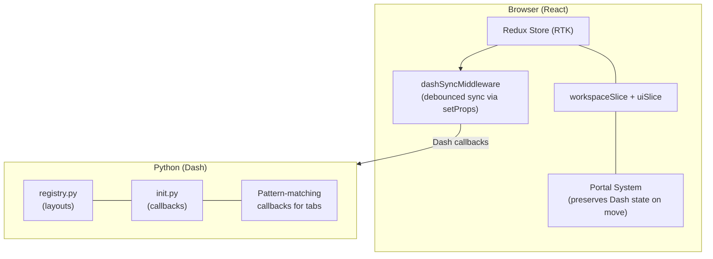
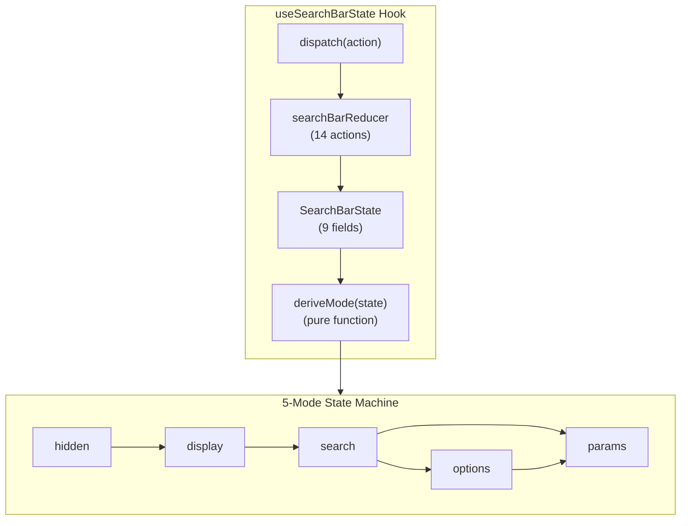

# CLAUDE.md

This file provides guidance to Claude Code (claude.ai/code) when working with code in this repository.

---

## Project Overview

**Dash Prism** is a multi-panel workspace manager for Plotly Dash applications. It provides a unified interface where users can open multiple Dash layouts as tabs within resizable, splittable panels. Think VS Code's panel system, but for Dash dashboards.

**Key Technologies:**
- **Frontend:** TypeScript, React 18, Tailwind CSS 4, Radix UI
- **Backend:** Python 3.10+, Plotly Dash 3.1.1+
- **State Management:** Redux Toolkit with redux-undo and redux-persist
- **Build:** Webpack 5, dash-generate-components
- **Dependencies:** Poetry (Python), npm (TypeScript)

---

## Development Commands

### Setup

Python deps are managed by Poetry. Either activate the venv once per shell, or prefix commands with `poetry run`.

```bash
poetry install                           # Install Python deps + dev/test groups
npm install                              # Install Node deps

# Activate the Poetry venv (one-time per shell)
source $(poetry env info --path)/bin/activate
# or use the npm script which prints the activate command:
npm run venv
```

### Build

```bash
npm run build              # Both JS bundle and Python component generation
npm run build:js           # Webpack bundle (production)
npm run build:js::dev      # Webpack bundle (development, faster)
npm run build:backends     # Generate Python Dash components from TypeScript
npm run watch              # Watch mode for JS development
```

### Testing

```bash
# TypeScript (Vitest)
npm run test:ts                          # Run all TS tests
npm run test:ts -- --testNamePattern="SearchBar"  # Run tests matching pattern
npm run test:ts:watch                    # Watch mode
npm run test:ts:coverage                 # Coverage report

# Python (pytest)
npm run test:unit                        # Unit tests only (no browser)
npm run test:integration                 # Selenium integration tests
npm run test                             # All Python tests

# Run a single Python test
pytest tests/test_registry.py::test_register_layout -v
pytest tests/integration/ --headless -v  # Integration tests in headless mode
```

### Code Quality

```bash
npm run lint && npm run lint:fix         # ESLint
npm run format                           # Prettier
black dash_prism tests                   # Python formatter
mypy                                     # Python type checker
```

### Running the Demo

```bash
poetry run python usage.py               # Opens http://127.0.0.1:5005
```

### Just Commands (optional)

If [just](https://github.com/casey/just) is installed:

```bash
just install              # Install all dependencies (Poetry + npm)
just build                # Build JS bundle + generate Python components
just test                 # Run all tests (TS + Python unit + integration)
just test-ts              # TypeScript tests only
just test-py              # Python unit tests only
just test-integration     # Selenium integration tests
just lint                 # Run all linters (tsc, black --check, mypy)
just format               # Format TypeScript with Prettier
just format-py            # Format Python with Black
```

---

## Architecture

### Dual-Stack Design



### Key Patterns

1. **Layout Registry** (`dash_prism/registry.py`): Global singleton stores layout metadata and render functions
2. **Redux Store** (`src/ts/store/`): Two slices — `workspaceSlice` (persisted, wrapped with redux-undo) and `uiSlice` (ephemeral)
3. **Portal System** (`react-reverse-portal`): Preserves Dash component state when tabs move between panels
4. **Dash Sync Middleware** (`src/ts/store/middleware/dashSyncMiddleware.ts`): Debounced sync of Redux state to Dash via `setProps`
5. **Pattern-Matching Callbacks:** Dynamic per-tab rendering via Dash's `MATCH` pattern

### Critical Files

| File | Purpose |
|------|---------|
| `src/ts/store/workspaceSlice.ts` | Persisted workspace state (tabs, panels, favorites) |
| `src/ts/store/uiSlice.ts` | Ephemeral UI state (modals, search bar modes, renaming) |
| `src/ts/store/index.ts` | Store factory with redux-persist, redux-undo, middleware |
| `src/ts/store/middleware/dashSyncMiddleware.ts` | Syncs Redux state to Dash backend |
| `src/ts/context/ConfigContext.tsx` | Dash props (theme, size, registered layouts) |
| `src/ts/context/PortalContext.tsx` | React portal management for tab content |
| `dash_prism/init.py` | Callback injection, layout rendering |
| `dash_prism/registry.py` | `@register_layout` decorator, layout storage |

### State Shape (TypeScript)

```typescript
// WorkspaceState — persisted via redux-persist, wrapped with redux-undo
type WorkspaceState = {
  tabs: Tab[];
  panel: Panel;                         // Root of recursive panel tree
  panelTabs: Record<PanelId, TabId[]>;  // Tab order per panel
  activeTabIds: Record<PanelId, TabId>; // Active tab per panel
  activePanelId: PanelId;
  favoriteLayouts: string[];
  searchBarsHidden: boolean;
};

// UiState — ephemeral, never persisted
type UiState = {
  searchBarModes: Record<PanelId, SearchBarMode>;
  renamingTabId: TabId | null;
  infoModalTabId: TabId | null;
  helpModalOpen: boolean;
  setIconModalTabId: TabId | null;
};
```

Note: `theme` is NOT in Redux state — it's a Dash prop accessed via `ConfigContext`. Undo/redo is handled by `redux-undo` wrapping the workspace slice (history is ephemeral, not persisted).

### Component Architecture: SearchBar

The SearchBar uses a **local reducer with derived mode pattern**:



**Key Design Principles:**
1. **Derived Mode** — Mode is computed from state flags, never stored directly (eliminates sync bugs)
2. **No Coordination Refs** — All state lives in reducer, visible in React DevTools
3. **Explicit Transitions** — Every state change goes through typed actions
4. **Pure Functions** — `deriveMode()` and reducer are testable without React

**Files:**
- `src/ts/components/SearchBar/searchBarReducer.ts` — Types, deriveMode(), reducer
- `src/ts/components/SearchBar/useSearchBarState.ts` — Hook wrapping reducer
- `src/ts/components/SearchBar/searchBarReducer.test.ts` — Unit tests (100% coverage)
- `tests/integration/test_searchbar.py` — Integration smoke tests

---

## Python API

### Layout Registration

```python
@dash_prism.register_layout(
    id='analytics',
    name='Analytics Dashboard',
    description='View analytics data',
    keywords=['analytics', 'charts'],
    allow_multiple=True
)
def analytics():
    return dcc.Graph(figure=px.bar(...))
```

### Parameterized Layouts

```python
@dash_prism.register_layout(
    id='chart',
    name='Chart View',
    param_options={
        'bar': ('Bar Chart', {'chart_type': 'bar'}),
        'line': ('Line Chart', {'chart_type': 'line'}),
    }
)
def chart_layout(chart_type: str = 'bar'):
    return dcc.Graph(figure=create_chart(chart_type))
```

### Initialization

```python
app.layout = html.Div([
    dash_prism.Prism(
        id='workspace',
        persistence=True,
        persistence_type='local',  # 'local', 'session', or 'memory'
        theme='light',
        size='md',
        maxTabs=16
    )
])
dash_prism.init('workspace', app)  # Must be called after layout is set
```

---

## Important Notes

### Auto-Generated Files (DO NOT EDIT)

These are regenerated by `npm run build:backends`:
- `dash_prism/PrismComponent.py`
- `dash_prism/PrismActionComponent.py`
- `dash_prism/PrismContentComponent.py`
- `dash_prism/_imports_.py`

Edit the wrapper files instead:
- `dash_prism/Prism.py` → wraps PrismComponent
- `dash_prism/Action.py` → wraps PrismActionComponent

### TypeScript Path Aliases

```typescript
import { Button } from '@components/ui/button';
import { Tab } from '@types/index';
import { useAppDispatch } from '@store/hooks';
```

### Adding a New Redux Action

1. Add the action to the appropriate slice (`src/ts/store/workspaceSlice.ts` or `src/ts/store/uiSlice.ts`)
2. Add selectors in `src/ts/store/selectors.ts` if needed
3. Decide if the action should be undo-excluded (add to `UNDO_EXCLUDED_ACTIONS` in `src/ts/store/index.ts`)
4. Write tests in the corresponding `.test.ts` file

### Persistence Caveat

Persisted workspace state may reference layouts that no longer exist after code changes. The `validateState` logic handles cleanup, but be aware when adding/removing layouts.

---

## Code Style

### TypeScript/React
- Prettier (tabWidth: 2, singleQuote: true, printWidth: 100)
- ESLint with TypeScript + React Hooks rules
- Functional components only; avoid `any` (prefer `unknown`)
- Path aliases: `@components`, `@constants`, `@context`, `@hooks`, `@types`, `@utils`, `@store`

### Python
- Black (line-length: 100)
- mypy for type checking (hand-written files only)
- reStructuredText docstrings for Sphinx docs
- Dependencies managed via Poetry (`pyproject.toml`)

---

## CI

CI (`.github/workflows/ci.yml`) runs four jobs:
- **test-py-version:** Tests across Python 3.10, 3.11, 3.12, 3.13, 3.14
- **test-dash-version:** Tests against Dash 3.1.1, 3.2.0, 3.3.0, 3.4.0, 4.0.0
- **lint:** `black --check` and `mypy` (ESLint is not run in CI)
- **build:** Builds wheel, validates contents, smoke-tests install

Both test jobs build the JS bundle, run TS unit tests, and run the full Python test suite (unit + integration with `--headless`).

---

## Stale Files

`.github/copilot-instructions.md` is outdated and contradicts this file. It references the old pre-Redux architecture (`prismReducer.ts`, `PrismContext.tsx`), claims `theme` lives in Redux state, and says `register_layout` accepts an `icon` parameter. Do not trust it.
